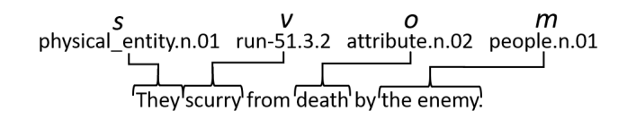
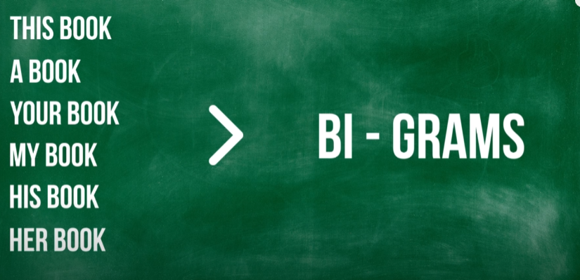

Link
===============

https://smartech.gatech.edu/handle/1853/64643

Notes
===============

1. Neural language models, such as encoder-decoder RNNs, are trained to predict the next token(s) in a sequence, given
   one or more input tokens. The network architecture and set of weights θ comprise a generative model capturing and
   generalizing over patterns observed in a training corpus.
2. The insight is that if one can extract some basic semantic information from the sentences of preexisting stories, one
   can learn the skeletons of what “good” stories are supposed to be like
3. event-to-event (author talks about a recurrent encoder decoder neural network for story generation)
    1. a textual story corpus is preprocessed—sentences are translated into my event representation by extracting the
       core semantic information from each sentence.
    2. However, event preprocessing is a lossy process, and the resultant events are not human-readable. To address
       this, I present a story generation pipeline in which a second neural network, event-to-sentence, translates
       abstract events back into natural language sentences.
4. Automated story generation can be formalized as follows: given a sequence of events, sample from the probability
   distribution over successor events. simple automated story generation can be expressed as a process whereby the next
   event is computed by sampling from or maximizing Pθ(et+1|et−k, ..., et−1, et) where θ is the set of parameters of a
   17 generative domain model, ei is the event at time i, and k indicates the size of a sliding window of context, or
   history.
5.  where v is a verb, s is the subject of the verb, o is the object of the verb, and m is the
   modifier—or “wildcard”, which can be a propositional object, indirect object, causal complement (e.g., in “I was glad
   that he drove,” “drove” is the causal complement to “glad.”), or any other dependency unclassifiable to Stanford’s
   dependency parser.
   
6. there are variations on the event representation that increase the level of abstraction (and thus decrease sparsity)
   and help the encoder-decoder network predict successor events. I enumerate some of the possible variations below.
    1. Generalized. Each element in the event tuple undergoes further abstraction.
    2. Character Name Numbering. There were two ways of numbering the character names that I experimented with. One way
       had the character name numbering reset with every sentence (consistent within sentence)–or, sentence PERSONs, my
       “default”. The other way had the numbering reset after every input-output pair (i.e. consistent across two
       sentences)–or, continued PERSONs.
    3. Adding Genre Information. I ran topic-modelling on the entire corpus using Python’s Latent Dirichlet Analysis4
       set for discovering 100 different categories.
7. Furthermore, my experiments with event representations for event-to-event indicate that greater generalization lends
   to better story generation.However, the greater the generalization, the harder it is to translate an event back into
   a natural language sentence.
8. The AI’s memory allows the agent to organize concepts based on recency. I proposed to use the event-indexing
   model [83], a psychology framework that is meant to explain how people comprehend new information and store it in
   their long-term memory
9. Using a schema—such as the event tuple representation from these experiments—in neural story generation can improve
   event generation performance, and the type of event representation selected matters.

Thoughts with Additional Information
===============

1. N-grams are one way to help machines understand a word in its context to get a better understanding of the meaning of
   a word.
    1. two sentences: We need to book our tickets soon / We need to read this book soon. How can we tell the difference
       of the word book in the sentence?
    2. Machines have to learn the cues to understand the words by looking at the surrounding context of the target word.
       For example, the machine learn the context before and after the word. So it would know if the word is used as a
       noun, verb, etc.
       
       BI-GRAMS are just 2 pairs of words, N-GRAMS are just N pairs of words
       
       However, the longer the context window, the harder it is to pick up on words that frequently appear throughout
       the text when you're looking at fairly unique sets of words.
2. Current language models maybe have too much relationship between each word? So it doesn't have a ability to really
   plan on saying something.
3. Why author used the event-to-event model to generate stories? Is it because the representation of the event by using
   symbolic AI is easier? but why?
   1. Languages have much more changes, instead, symbol doesn't have much to change. 
4. could local consistency be fully controlled by GPT? Why not?

Summary
===============
In this chapter, author talks about how to generate the stories with the previous stories in order to control the 
local consistency (From last sentence to the next sentence). Author mentions a lot of evaluation methods and standard. 
She also talks about the long-term memory issue. 

