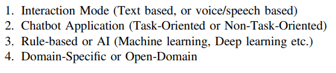
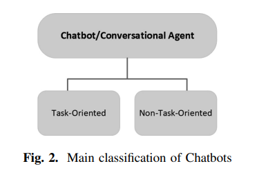

Link
===============

A Survey on Conversational Agents Chatbots Classification and Design Techniques
https://link.springer.com/chapter/10.1007/978-3-030-15035-8_93

Notes
===============

1. The interaction between humans and computer systems is shifting towards natural language-based interfaces.
2. The broad classification of chatbot can be done based on the following criteria
    1. 
3. in general, chatbots are classified into two main categories based on goals
    1. Task-oriented chatbots
    2. Non-task-oriented chatbots
    3.   Task-oriented chatbots are designed for a particular task and are set up to have short
       conversations, usually within a closed domain. Unlike task-oriented chatbots, non-task oriented chatbots can
       simulate a conversation with a person and seem to perform chitchat for entertainment purpose in open domains

Thoughts with Additional Information
===============

Summary
===============
