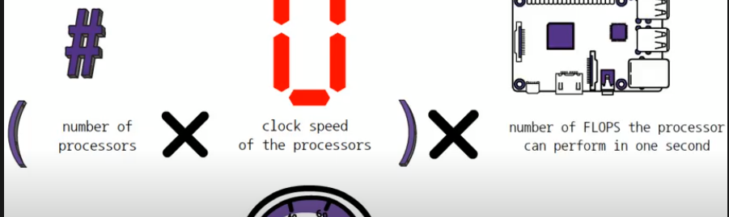

Link
===============

ZeRO: Memory Optimizations Toward Training Trillion Parameter Models
https://arxiv.org/abs/1910.02054

Notes
===============

1.

Thoughts with Additional Information
===============

1. FLOPS
    1. Floating-Point Operations Per Second (flops), how fast can a processor do math.
    2. one petaFlops is equal to 1,000,000,000,000,000 = 1, 000 teraFLOPS
2. R peak
    1. it is a measure of the theoretical maximum number of floating point operations that the system can perform per
       second.
    2. 
3. petaByte
    1. equal to one quadrillion bytes
    2. 1PB = 1000 TB

Summary
===============
