Link
===============

ERNIE 3.0: LARGE-SCALE KNOWLEDGE ENHANCED PRE-TRAINING FOR LANGUAGE UNDERSTANDING AND GENERATION
https://arxiv.org/pdf/2107.02137.pdf

Notes
===============

1. large-scale models are trained on plain texts without introducing knowledge such as linguistic knowledge and world
   knowledge. In addition, most large-scale models are trained in an autoregressive way. As a result, this kind of
   traditional fine-tuning approach demonstrates relatively weak performance when solving downstream language
   understanding tasks. In order to solve the above problems, we propose a unified framework named ERNIE 3.0 for
   pre-training large-scale knowledge enhanced models. It fuses autoregressive network and auto-encoding network, so
   that the trained model can be easily tailored for both natural language understanding and generation tasks with
   zero-shot learning, few-shot learning or fine-tuning.
2. In general, pretrained language models are learned on a large amount of text data in a self-supervised manner.
3. In summary, our contributions are as follows:
    1. We propose a unified framework ERNIE 3.0, which combines auto-regressive network and auto-encoding network so
       that the trained model can handle both natural language understanding and generation tasks through zero-shot
       learning, few-shot learning or fine-tuning.
    2. We pre-train large-scale knowledge enhanced models with 10 billion parameters and evaluate them with a series of
       experiments on both natural language understanding and natural language generation tasks. Experimental results
       show that ERNIE 3.0 consistently outperforms the state-of-the art models on 54 benchmarks by a large margin and
       achieves the first place on the SuperGLUE [3] benchmark.
4. Knowledge Enhanced Models
    1. Pre-trained language models capture syntactical and semantic knowledge from large-scale corpus, but lack world
       knowledge. Recently, several works have attempted to incorporate world knowledge in pre-trained language models.
5. ERNIE 3.0
    1. Overview of ERNIE 3.0 Framework
        1. 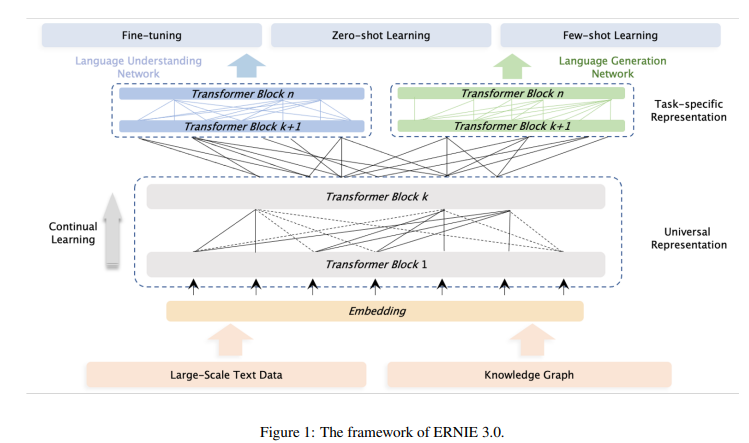  ERNIE 3.0 is shown in Figure 1, which can be widely used for pre-training,
           fine-tuning and zero/few-shot learning. Unlike the prevalent unified pre-training strategy of employing a
           shared Transformer network for different well-designed cloze tasks and utilizing specific self-attention
           masks to control what context the prediction conditions on, ERNIE 3.0 designs a new Continual Multi-Paradigms
           Unified Pre-training Framework. We believed that the different task paradigms of natural language processing
           depend on identical underlying abstract features consistently, such as lexical information and syntactic
           information, but the requirements of top-level concrete features are incompatible, in which the natural
           language understanding tasks have the disposition to learn the semantic coherence while natural language
           generation tasks expect further contextual information.
        2. We refer to the backbone shared network and task-specific networks as the Universal Representation Module and
           Task-specific Representation Modules in ERNIE 3.0. Specifically, ERNIE 3.0 employs the collaborative
           architecture of a Universal Representation Module and two Task-specific Representation Modules, namely
           natural language understanding (NLU) specific representation module and natural language generation (NLG)
           specific representation module
        3. ERNIE 3.0 sets the task-specific representation module to a manageable size, that is a base model size,
           instead of the multi-layer perceptron or shallow Transformer commonly used in multi-task learning, which will
           produce three obvious benefits, the first is that the base network has a stronger ability to capture semantic
           information than multi-layer perceptron and shallow Transformer; the second is that the task-specific
           networks with base model size enable ERNIE 3.0 to distinguish the top-level semantic information among
           different task paradigms without significantly increasing the parameters of a large-scale model; finally, the
           smaller model size of a task-specific network than a shared network 4 would lead to realizable practical
           applications for large scale pre-trained model when only fine-tuning on the taskspecific representation
           module. ERNIE 3.0 constructs two task-specific representation modules, that is NLU-specific representation
           module and NLG-specific representation module, in which the former is a bi-directional modeling network while
           the latter is a uni-directional modeling network.
    2. Pre-training Tasks
        1. Word-aware Pre-training Tasks
            1. Knowledge Masked Language Modeling. It introduced phrase masking and named entity masking that predict
               the whole masked phrases and named entities to help the model learn the dependency information in both
               local contexts and global contexts.
            2. Document Language Modeling. ERNIE 3.0 opt for traditional language model as the pre-training task to
               abate the network complexity and heighten the effectiveness of unified pre-training. In addition, to
               enable the NLG network of ERNIE 3.0 to model longer text, we introduce the Enhanced Recurrence Memory
               Mechanism proposed in ERNIE-Doc [37], which can model a larger effective context length than traditional
               recurrence Transformer by changing the shifting-one-layer-downwards recurrence to the same-layer
               recurrence.
        2. Structure-aware Pre-training Tasks
            1. Sentence Reordering. Sentence reordering task aims to train the model to learn the relationship between
               sentences by reorganizing permuted segments. At length, a given paragraph is randomly split into 1 to m
               segments during pre-training and all of the combinations are shuffled by a random permuted order. Then,
               the pre-trained model is asked to reorganize these permuted segments, modeled as a k-class classification
               problem where k = Pm n=1 n!.
            2. Sentence Distance. Sentence distance task, an extension of traditional next sentence prediction (NSP)
               task, is widely used in various pre-trained models to enhance their ability to learn the sentence-level
               information, which can be modeled as a 3-class classification problem. The three categories represent
               that the two sentences are adjacent, nonadjacent but in the same document and from two different
               documents respectively
        3. Knowledge-aware Pre-training Tasks.
            1. Universal Knowledge-Text Prediction. To incorporate knowledge into one pre-trained language model, we
               introduce universal knowledge-text prediction (UKTP) task, which is an extension of knowledge masked
               language modeling. 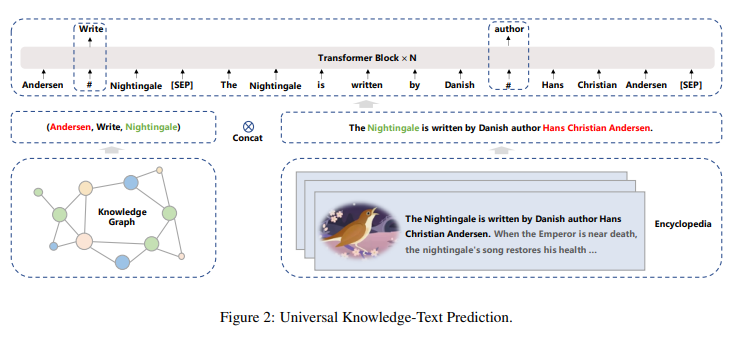 . Given a pair of triple from knowledge graph and the
               corresponding sentence from encyclopedia, we randomly mask relation in triple or words in a sentence. To
               predict the relation in the triple, the model needs to detect mentions of head entity and tail entity and
               determine semantic relationship that holds between them in the corresponding sentence. The essence of
               this process is similar to the distant supervision algorithm [40] in relation extraction tasks. The
               distant supervision algorithm assume that if two entities participate in a relation, any sentence that
               contain those two entities might express that relation.
        4. ERNIE 3.0 trains the NLU network through knowledge masked language modeling to improve the capacity of
           capturing the lexical information, trains the sentence reordering task and the sentence distance discerning
           task to strengthen the ability of capturing the syntactic information, and finally optimizes the model with
           the universal knowledge-text prediction task to improve knowledge memorization and reasoning. Meanwhile,
           ERNIE 3.0 trains the NLG network with the document language modeling task to enable various generation
           styles.
    3. Pre-training Process
        1. Pre-training Algorithm. Progressive training was originally proposed to improve stability, which starts from
           an efficient and small model and gradually increase the capacity.
        2. Pre-training Data. To ensure the success of the pre-training of ERNIE 3.0, we construct a large-scale,
           wide-variety and high-quality Chinese text corpora amounting to 4TB storage size in 11 different categories.
           To our best knowledge, this is currently the largest Chinese pre-training corpora compared with
           CLUECorpus2020 [45] (100GB), Chinese multi-modal pre-training data [21] (300GB), WuDaoCorpus2.0 used by
           CPM-2 [20] (2.3TB Chinese data and 300GB English data) and PanGu Corpus [22] (1.1TB).
            1. To improve the data quality, we adopt the following pre-processing strategies:
                1. Deduplication is conducted on different granularities including character level, paragraph level and
                   document level. On the character level, we replace consecutive identical characters (i.e., spaces,
                   tabs, exclamation mark, question mark and etc) with one single character. One the paragraph level, we
                   replace two identical consecutive paragraphs consisting of N sentences with one single paragraph
                   where 0 < N < 100. The two aforementioned deduplication strategies are critical for ERNIE 3.0 to
                   generate non-repeating contents. At last, we adopted Message Digest Algorithm5 (MD5) to filter
                   duplicate documents by comparing the sum of the MD5 of top-3 longest sentences from each document.
                2. Sentences with less than 10 words are filtered since they may be problematic or incomplete ones which
                   contains limited semantic information for model pre-training.
                3. We further conduct sentence segmentation using regular expressions and word segmentation based on
                   Baidu’s word segmentation tool. This helps ERNIE 3.0 to learn better sentence boundary and named
                   entity knowledge during pre-training.
        3. Pre-training Settings. Both the universal representation module and the task-specific representation modules
           of ERNIE 3.0 uses the Transformer-XL[34] structure as the backbone. For the universal representation module,
           we adopt a structure with 48 layers, 4096 hidden units and 64 heads. For the task-specific representation
           modules, we adopt a structure with 12 layers, 768 hidden units and 12 heads. The total parameter of universal
           representation module and task-specific representation modules is 10 billion. The activation function used is
           GeLU[46]. The maximum sequence length of context and the memory length of language generation is set to 512
           and 128, respectively. The total batch size of all pre-training tasks is set to 6144. We use Adam[47] with
           learning rate of 1e-4, β1 = 0.9, β2 = 0.999, L2 weight decay of 0.01, learning rate warmup over the first
           10,000 steps and linear decay of the learning rate. In the first 10,000 steps, we also use the progressive
           learning to speedup convergence in the initial stage of pre-training. The model is trained for a total of 375
           billion tokens with 384 NVDIA v100 GPU cards and is implemented on PaddlePaddle framework. By virtue of
           parameter sharding used in [48, 49], we manage to reduce the memory usage of our model and address the
           problem of the total parameter of model exceeding the memory of a single GPU card.
6. Experiments
    1. 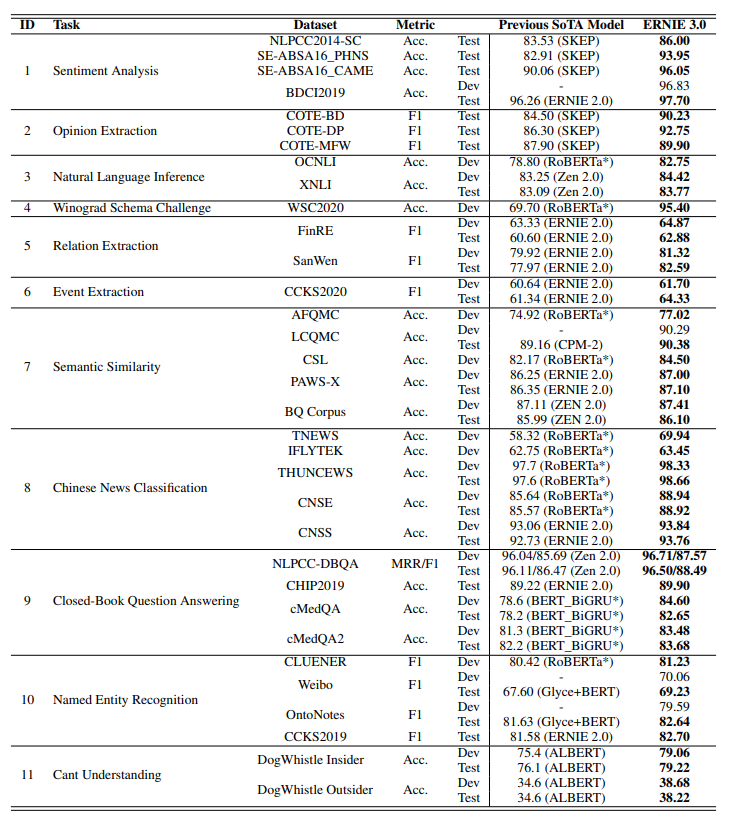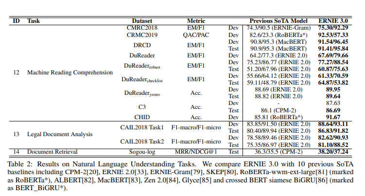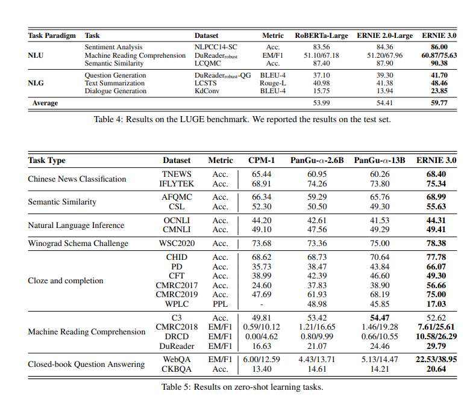
7. Conclusion
    1.

Thoughts with Additional Information
===============

1. why most large-scale models are trained only with plain texts?
    1. high efficiency?
2. why most large-scale models are trained in an autoregressive way?
    1. focusing on certain features of language model? text generation
3. self-supervised
    1. take abundant and readily available data, unlabeled data, and use it to understand itself
    2. show a machine a segment of a video and then stop the video and ask the machine to predict what's going to happen
       next. Later, show the machine what is really the next and let the machine make better prediction next time.
    3. human has a model in mind of what's possible and not possible. Human are given partial information about the
       state of the world given by the perception
4. what does increasing model size bring to the language model?
    1. if larger model size means more possibilities, the number of combinations for languages might is limited, then
       why we need such many parameters to consider such many possibilities?
5. Autoencoder
    1. a type of neural network that can be used to learn a compressed representation of raw data.
6. multi-task learning
    1. start a neural network simultaneous do several things at the same time
    2. 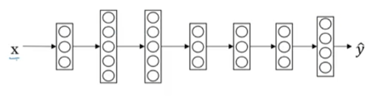 we see the y^ here has four dimensions 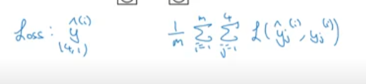
    3. different from the softmax function, it can have multiple 1 during prediction.
    4. For the training dataset, even some features are not labeled, it could still be used for training to multitask
       learning neural network.
    5. When multi-task learning makes sense?
        1. training on a set of tasks that could benefit from having shared lower-level features.
        2. Usually: Amount of data you have for each task is quite similar 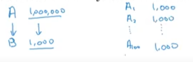. This image shows the
           different dataset structure for transfer learning and multitask learning.
        3. Can train a big enough neural network to do well on all the tasks.
7. perplexity
    1. 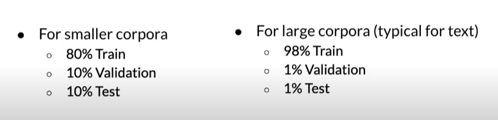
    2. By exponentiating the Cross-Entropy we retrieve perplexity 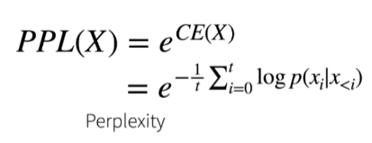
    3. 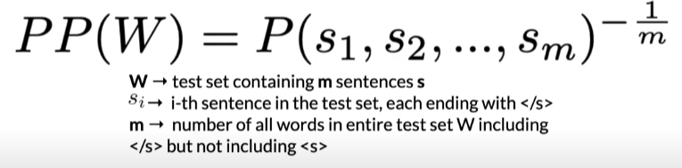 Can be understood as how complex a certain text is. Complex here means how likely the
       sentence is written by human then randomly by machine. A sentence written by humans is more likely to have a
       lower perplexity score.
    4. perplexity is the inverse of probability of test set normalize by the number of words in test set. So the higher
       the language model estimate the probability of the test set, the lower perplexity going to be.
    5. 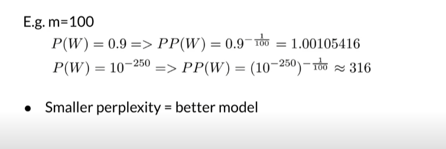 Character level models PP < word-based models PP
    6. 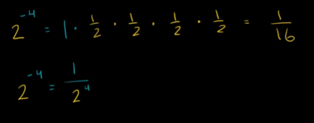 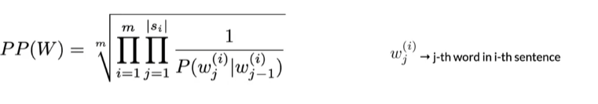 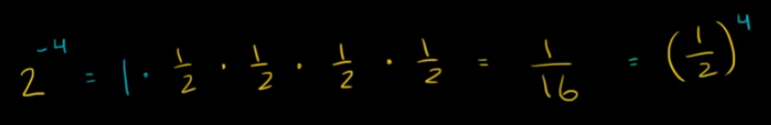 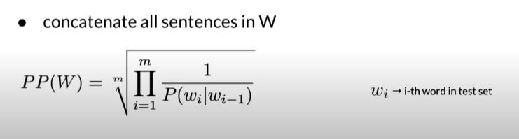
       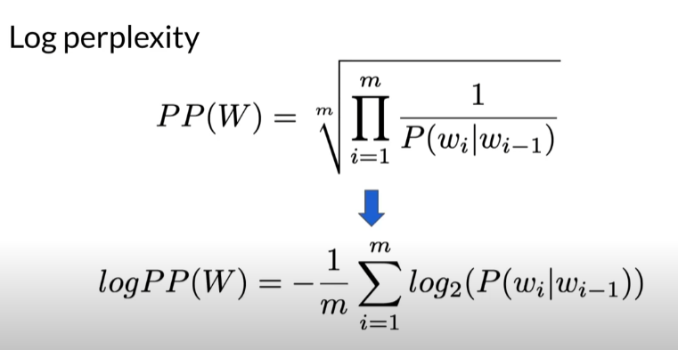
8. GPT-3 has 570GB data, ERNIE has 4T data, why the size is so different?
    1. is it related to model structure selection, language difference or any other reasons?
    2. Because the Chinese words are much lesser than English words, I supposed English corpus should be bigger than
       Chinese corpus.
9. Weight decay is a regularization technique, which lets us control the generalization of the learning algorithm, by
   adding a criterion to t whe minimization target, that expresses a preferemce for the weights.
   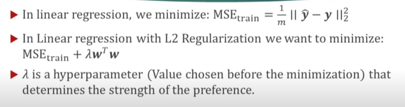
10. It seems like ERNIE 3 only has 10 B parameter, which is way smaller than GPT-3, why it performs so well on many
    tasks?

Summary
===============
This paper talks about a Chinese pre-train language model called ERNIE 3.0. It has 10 B parameters trained with
knowledge enhanced technique. Thus, the model has both strong natural language generation ability with natural language
understanding ability. In order to make model perform well on fine-tune, zero-shot and few-shot for a numbers of tasks.
The ERNIE 3.0 use the framework of Universal Representation Module and Task-specific Representation Modules. The
Universal Representation Module is a transformer XL model which share common knowledge of language while the
Task-specific Representation Modules train on task specific data and benefit with more specific tasks. 