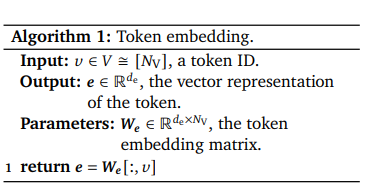

Link
===============

Formal Algorithms for Transformers
https://arxiv.org/pdf/2207.09238.pdf

Notes
===============

1. One may argue that most DL models are minor variations of a few core architectures, such as the Transformer [VSP+17],
   so a reference augmented by a description of the changes should suffice. This would be true if (a) the changes were
   described precisely, (b) the reference architecture has been described precisely elsewhere, and (c) a reference is
   given to this description. Some if not all three are lacking in most DL papers.
2. Providing open source code is very useful, but not a proper substitute for formal algorithms.
3. Examples of good neural network pseudocode and mathematics and explanations.
    1. Multi-Layer Perceptrons (MLPs) are usually welldescribed in many papers
4. This work aims to do the same for Transformers: The whole decoder-only Transformer GPT Algorithm 10 based on
   attention Algorithms 4 and 5 and normalization Algorithm 6 including training Algorithm 13 and prompting and
   inference Algorithm 14 all-together is less than 50 lines of pseudocode
5. Motivation
    1. They can be used as templates and adapted to precisely describe future variations, and therewith set a new
       standard in DL publishing. We explicitly encourage the reader to copy and adapt them to their needs and cite the
       original as “adapted from
    2. Having all that matters on one page in front of you makes it easier to develop new variations compared to reading
       prose or scrolling through 1000s of lines of actual code.
    3. They can be used as a basis for new implementations from scratch, e.g. in different programming languages,
       without having to wade through and reverse-engineer existing idiosyncratic real source code.
    4. They may establish notational convention, which eases communication and reading future variations.
    5. The process of converting source code into pseudocode can exhibit implementation errors
    6. Theoreticians need compact, complete, and precise representations for reasoning and ultimately proving properties
       about algorithms. They are often unwilling or unable to reverse engineer code, or guess the meaning of words or
       fancy diagrams.
6. Chunking The predominant paradigm in machine learning is (still) learning from independent and identically
   distributed (i.i.d.) data. Even for sequence modelling for practical reasons this tradition is upheld. The training
   data may naturally be a collection of (independent) articles, but even then, some may exceed the maximal context
   length max transformers can handle. In this case, an article is crudely broken into shorter chunks of length ≤ max.
7. Sequence modelling (DTransformer). Given a vocabulary 𝑉, let 𝒙𝑛 ∈ 𝑉 ∗ for 𝑛 ∈ [𝑁data] be a dataset of
   sequences (imagined to be) sampled i.i.d. from some distribution 𝑃 over 𝑉 ∗ . The goal is to learn an estimate 𝑃ˆ
   of the distribution 𝑃(𝒙). In practice, the distribution estimate is often decomposed via the chain rule as 𝑃ˆ(𝒙)
   = 𝑃ˆ𝜽(𝑥 [1]) · 𝑃ˆ𝜽(𝑥 [2] | 𝑥 [1]) · · · 𝑃ˆ𝜽(𝑥 [] | 𝒙[1 :  − 1]), where 𝜽 consists of all neural network
   parameters to be learned. The goal is to learn a distribution over a single token 𝑥 [𝑡] given its preceding tokens
   𝑥 [1 : 𝑡 − 1] as context.
8. Sequence-to-sequence (seq2seq) prediction
   (EDTransformer). Given a vocabulary 𝑉 and an i.i.d. dataset of sequence pairs (𝒛𝑛, 𝒙𝑛) ∼ 𝑃, where 𝑃 is a
   distribution over 𝑉 ∗ × 𝑉 ∗ , learn an estimate of the conditional distribution 𝑃(𝒙|𝒛). In practice, the
   conditional distribution estimate is often decomposed as 𝑃ˆ(𝒙|𝒛) = 𝑃ˆ𝜽(𝑥 [1] | 𝒛) · 𝑃ˆ𝜽(𝑥 [2] | 𝑥 [1], 𝒛)
   · · · 𝑃ˆ𝜽(𝑥 [] | 𝒙[1 :  − 1], 𝒛).
9. Classification Given a vocabulary 𝑉 and a set of classes [𝑁C], let (𝒙𝑛, 𝑐𝑛) ∈ 𝑉 ∗ × [𝑁C] for 𝑛 ∈ [𝑁data] be
   an i.i.d. dataset of sequence-class pairs sampled from 𝑃(𝒙, 𝑐). The goal in classification is to learn an estimate
   of the conditional distribution 𝑃(𝑐|𝒙).
10. Tokenization: How Text is Represented
    1. Character-level tokenization. One possible choice is to let 𝑉 be the English alphabet (plus punctuation). In the
       example above, we’d get a sequence of length 36: [‘M’, ‘y’, ‘ ’, ...]. Characterlevel tokenization tends to yield
       very long sequences.
    2. Word-level tokenization. Another choice would be to let 𝑉 consist of all English words (plus punctuation). In
       the example above, we’d get a sequence of length 7: [‘My ’, ‘grandma ’, ‘makes ’, ...]. Word-level tokenization
       tends to require a very large vocabulary and cannot deal with new words at test time.
    3. Subword tokenization. This is the method used in practice nowadays: 𝑉 is a set of commonly occurring word
       segments like ‘cious’, ‘ing’, ‘pre’. Common words like ‘is ’ are often a separate token, and single characters
       are also included in 𝑉 to ensure all words are expressible.
    4. Final vocabulary and text representation. Given a choice of tokenization / vocabulary, each vocabulary element is
       assigned a unique index in {1, 2, . . . , 𝑁V − 3}. A number of special tokens are then added to the vocabulary.
       The number of special tokens varies, and here we will consider three: mask_token := 𝑁V − 2, used in masked
       language modelling (see Algorithm 12); bos_token := 𝑁V − 1, used for representing the beginning of sequence; and
       eos_token := 𝑁V, used for representing the end of sequence. The complete vocabulary has 𝑁V = |𝑉| elements.
11. Architectural Components
    1. 

Thoughts with Additional Information
===============

1. why it's been 5 years of the inception of the Transformers. There is a paper started to analysis the algorithms of
   the transformers.
2. sequence modelling
    1. sequence modelling is the process of producing a sequence of values from a set of input values
3. sequence-to-sequence prediction, why in practive, the conditional distribution estimate is often decomposed as 𝑃ˆ(
   𝒙|𝒛) = 𝑃ˆ𝜽(𝑥 [1] | 𝒛) · 𝑃ˆ𝜽(𝑥 [2] | 𝑥 [1], 𝒛) · · · 𝑃ˆ𝜽(𝑥 [] | 𝒙[1 :  − 1], 𝒛).
    1. is it because in this way the information from each word can be fully extracted?
    2. Is it because extracting each token can fully use the meaning of the token like the byte-pair encoding.
4. independent and identically distributed (i.i.d.) data
    1. data = D D[1] independet of D[2]  D ~ Normal Distrubtion

Summary
===============
