Link
===============

OPT: Open Pre-trained Transformer Language Models
https://arxiv.org/pdf/2205.01068.pdf

how floating point works
https://www.youtube.com/watch?v=dQhj5RGtag0

Notes
===============

1. Large language models (LLMs) trained on massive text collections have shown surprising emergent capabilities to
   generate text and perform zero- and few-shot learning
2. We present results on eight Transformer language models ranging from 125 million to 175 billion parameters.
3. For weight initialization, we follow the same settings provided in the Megatron-LM codebase,4 using a normal
   distribution with zero mean and standard deviation of 0.006. Standard deviation for output layers are scaled by a
   1.0/ √ 2L term where L is the total number of layers. All bias terms are initialized as 0, and all models are trained
   with ReLU activation and a sequence length of 2048. We use an AdamW optimizer (Loshchilov and Hutter, 2017) with (β1,
   β2) set to (0.9, 0.95), and weight decay of 0.1. We follow a linear learning rate schedule, warming up from 0 to the
   maximum learning rate over the first 2000 steps in OPT-175B, or over 375M tokens in our smaller baselines, and
   decaying down to 10% of the maximum LR over 300B tokens. Our batch sizes range from 0.5M to 4M depending on the model
   size (see Table 1) and is kept constant throughout the course of training. We use a dropout of 0.1 throughout, but we
   do not apply any dropout to embeddings. We clip gradient norms at 1.0, except for some midflight changes that reduce
   this threshold down from 1.0 to 0.3 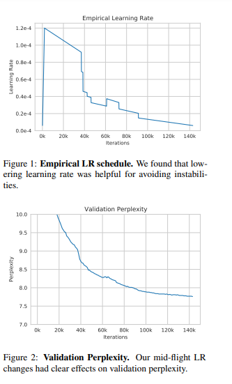
4. We found the Pile was particularly full of duplicate documents, and advise future researchers using the Pile to
   perform additional de-duplication processing
5. Corpus for RoBERTa:
    1. We included the BookCorpus (Zhu et al., 2015) and Stories (Trinh and Le, 2018) subsets of the RoBERTa corpus and
       utilized an updated version of CCNews, containing news stories crawled through September 28, 2021.
6. Corpus for The Pile:
    1. We included a subset of the Pile
       (Gao et al., 2021a), including: CommonCrawl, DM Mathematics, Project Gutenberg, HackerNews, OpenSubtitles,
       OpenWebText2, USPTO and Wikipedia.
7. Corpus for PushShift.io Reddit
    1. We included a subset of the Pushshift.io corpus produced by Baumgartner et al. (2020) and previously used by
       Roller et al. (2021). To convert the conversational trees into language-model-accessible documents, we extracted
       the longest chain of comments in each thread and discarded all other paths in the tree. This reduced the corpus
       by about 66%.
8. Training Processes
    1. Hardware Failures
    2. Loss divergences
    3. Other Mid-flight Changes
9. We speculate the high performance of PaLM comes predominantly from higher quality and diversity of pre-training data.
10. Bias & Toxicity Evaluation
    1. Hate Speech Detection we measure the ability of OPT-175B to identify whether or not certain English statements
       are racist or sexist (or neither) 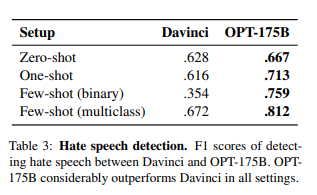
    2. CrowS-Pairs CrowSPairs (Nangia et al., 2020) is a crowdsourced benchmark aiming to measure intrasentence level
       biases in 9 categories: gender, religion, race/color, sexual orientation, age, nationality, disability, physical
       appearance, and socioeconomic status. 
    3. StereoSet we use StereoSet (Nadeem et al., 2021)
       to measure stereotypical bias across 4 categories:
       profession, gender, religion, and race. In addition to intrasentence measurement (similar to CrowSPairs),
       StereoSet includes measurement at the intersentence level to test a model’s ability to incorporate additional
       context. 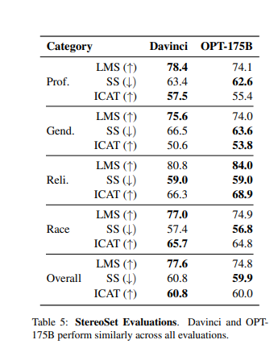
    4. RealToxicityPrompts We evaluate the tendency of OPT-175B to respond with toxic language via the
       RealToxicityPrompts 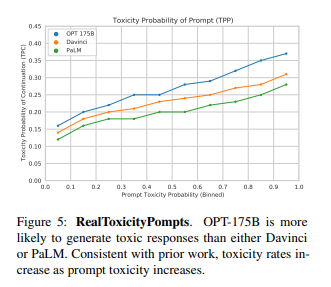
11. Limitations
    1. In particular, we found OPT-175B does not work well with declarative instructions or point-blank interrogatives.
    2. We believe OPT-175B will also benefit from retrieval-augmentation in future iterations.
    3. In summary, we still believe this technology is premature for commercial deployment. Despite including data
       sheets and model cards, we believe more scrutiny should be afforded to the training data with additional data
       characterization and selection criteria in order to use data responsibly

Thoughts with Additional Information
===============

1. TFLOP/s
    1. TFLOP = Teraflop. The numbers of flops the processor can perform in one sec.
    2. CPU normally has 10 - 20 processors. while GPU has 100 - 1000 processors.
2. What's is the normal difference between different size of models. 125m - 1.3b - 175b. How much would the performance
   differs and why these numbers?
3. with variations in batch size mostly to obtain increased computational efficiency. How?
    1. increasing the batch size means to have more data put into the computing process once. Then we definitely need
       more computing resources for it. Although the model might converge faster, how much could it actually increase
       the computational efficiency?
4. Normal distribution
    1. 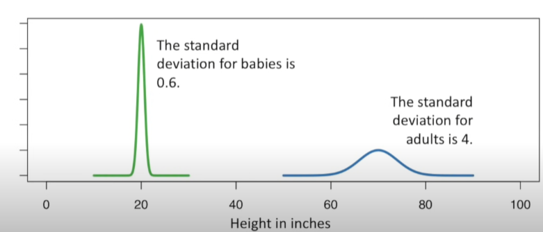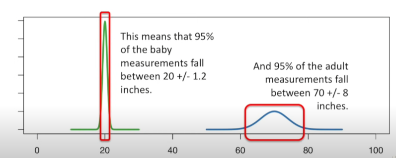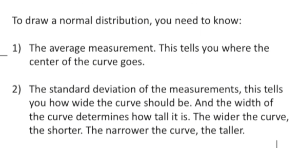
5. optimizers
    1. it defines how the neural networks learn
    2. gradient Descent is the original optimizer 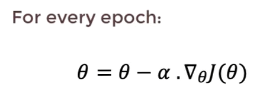, the problem it has is it trains on the whole
       dataset, thus the weight changes are too large to make the model find the case where the lost function gives the
       lowest output. So we have stochastic gradient descent 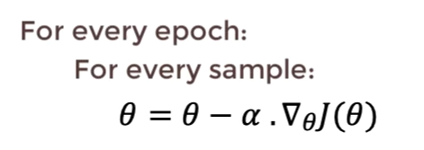 (but may make very noisy jump). So
       we have mini-batch gradient descent 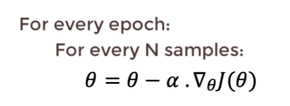. We also have SGD + Momentum 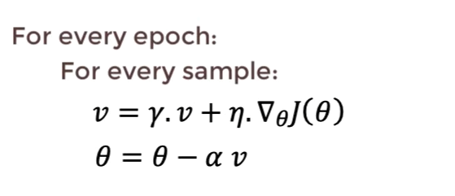.
       The model parameters might have the tendency to change in one direction. However, if the momentum is too larage
       to ignore the value of the training samples might be a problem. Then we have SGD + Momentum +
       Acceleration 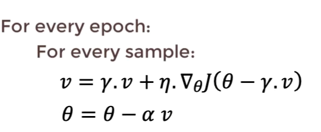. So the learning process recognize the values the sample examples give to
       the calculating process.
    3. 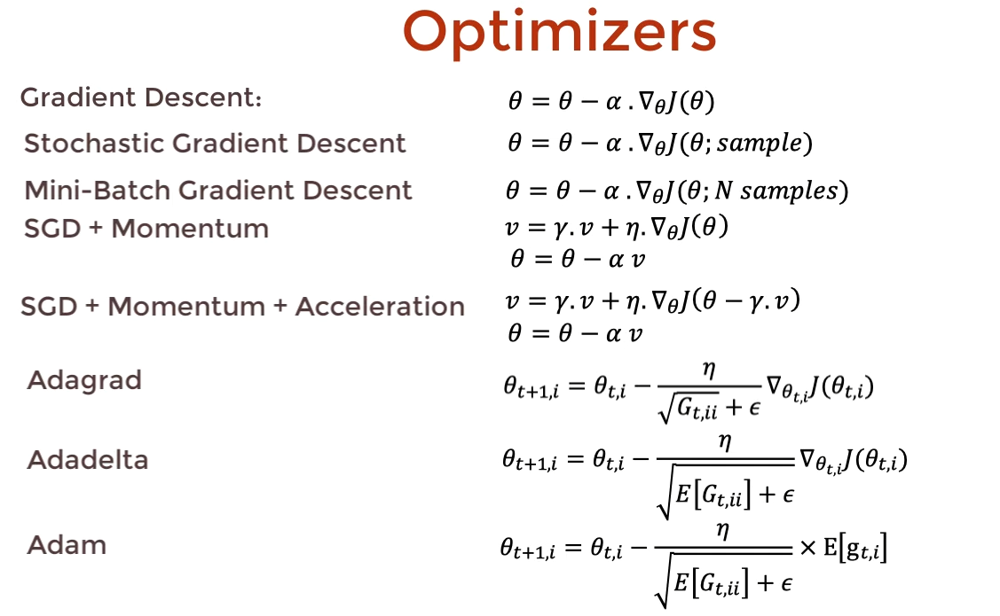 Different task might be fitted by different optimizers.
6. Warm up
    1. If your data set is highly differentiated, you can suffer from a sort of "early over-fitting". If your shuffled
       data happens to include a cluster of related, strongly-featured observations, your model's initial training can
       skew badly toward those features -- or worse, toward incidental features that aren't truly related to the topic
       at all. Warm-up is a way to reduce the primacy effect of the early training examples. Without it, you may need to
       run a few extra epochs to get the convergence desired, as the model un-trains those early superstitions. Many
       models afford this as a command-line option. The learning rate is increased linearly over the warm-up period. If
       the target learning rate is p and the warm-up period is n, then the first batch iteration uses 1*p/n for its
       learning rate; the second uses 2*p/n, and so on: iteration i uses i*p/n, until we hit the nominal rate at
       iteration n. This means that the first iteration gets only 1/n of the primacy effect. This does a reasonable job
       of balancing that influence. Note that the ramp-up is commonly on the order of one epoch -- but is occasionally
       longer for particularly skewed data, or shorter for more homogeneous distributions. You may want to adjust,
       depending on how functionally extreme your batches can become when the shuffling algorithm is applied to the
       training set.
7. warm up is to prevent early over-fitting
    1. what is early over-fitting (local minimum)?
    2. If we use a larger batch size on our first epoch, will it work the same as warm up process? Because the chance of
       having identical non-related topic samples will be small.
8. Learning rate decay
    1. to slowly reduce the learning rate in time. So when the gradient descent to certain point, the noise will not
       influence that much on the model convergence.
    2. 1 epoch = 1 pass through the data
9. Dropout
    1. Intuitively, the dropout makes the model cannot rely on any one feature, so have to spread out weights.
    2. Also dropout prevent overfitting
    3. We use a dropout of 0.1 throughout, but we do not apply any dropout to embeddings.
        1. embeddings shall mean the input features
10. Gradient clipping
    1. for exploding gradient problem
    2. we keep the gradient values in certain threshold
    3. or we could clipping by norm, set the largest value be 1 and the rest are set by same ratio
11. For gradient exploding problem. The cost function will get a huge number to nan, that cannot be used for doing any
    calculating. For gradient vanish problem, the cost function will get a tiny number, which update the weights too
    slowly to barely improve the performance of the model.
12. large spike in training process
    1. 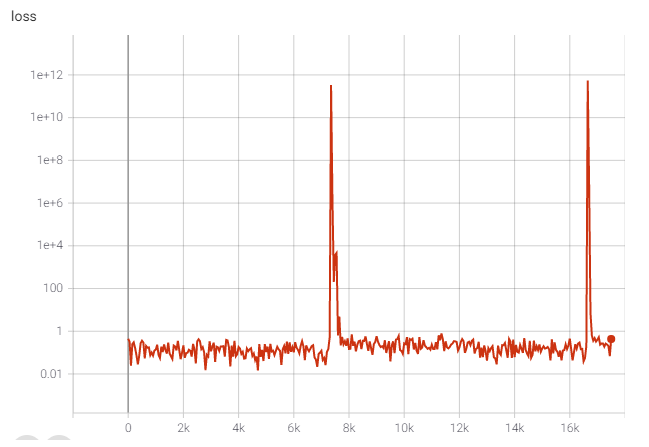
13. FP16 and FP32
    1. FP32 is known as single-precision floating-point, while FP16 is half-precision floating-point. FP32 has been the
       standard format for GPU operations for many years, but certain operations don't benefit from the added precision
       and can run faster in FP16 mode — assuming the GPU suports fast FP16 modes. Basically, FP32 allows for larger
       numbers than FP16 and is useful for more complicated workflows. However, FP32 needs twice the memory bandwidth
       and isn't necessary in some workloads.
14. how floating-point works.
    1. computers store information in bits (0, 1) , which can be anything with that has two distinct states (on/off,
       true/false, one/zero).
    2. This is how bits represent numers: 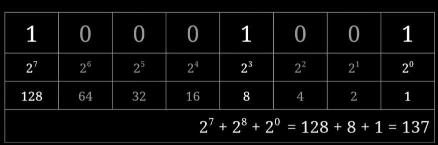 Every position within the byte is associated with a
       specific power of two.
    3. 1 byte equal 8 bits, which can represent the most 255 as numbers. This particular implementation is called an
       "eight-bit unsigned integer" (As there is no way to represent negative numbers)
    4. 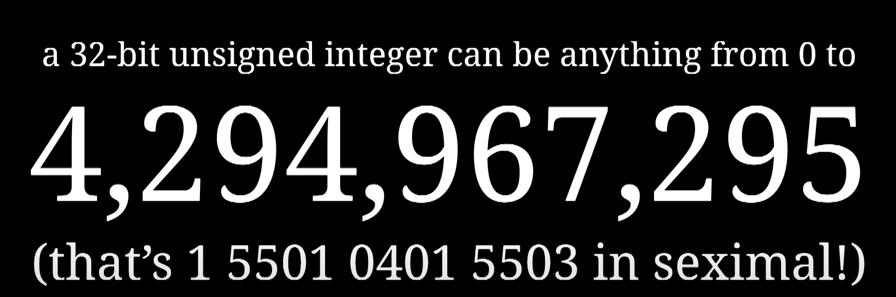 For super large numbers, maybe we could come up with a better way to use bit to
       represent these numbers instead of simply add up the number of bits.
    5. 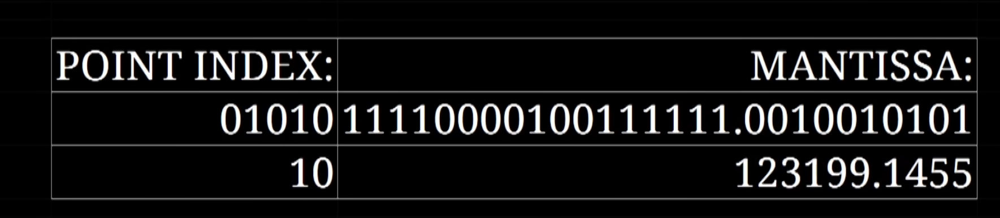 We could use 5 bits to represent 32 position to decide where the point location is in
       all the other bits. We can also use these extra values to place the binary point outside of the mantissa, the
       more bits we use for the position of the binary point, the wider the range of numbers we can represent ends up
       being, but at the same time you lose a lot of precision.
    6. However, we realize the current floating-point method has several drawbacks. The same number can actually be
       represented by a lot of different ways. For example, there are more than 500 ways to represent number 0.
    7. It turns out we could use scientific notations way to represent numbers.
        1. for example, we can take the eight point-index bits and turn them into an exponent 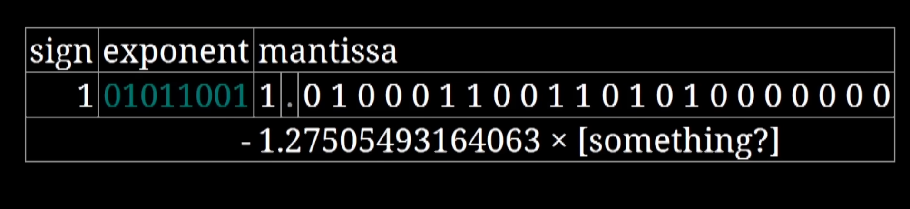
        2. Also, seems like there is no way to represent the number between 1 and 0. Instead of making the first of the
           8 bits be a sign to represent negative and positive number for exponent, it's a better idea to minus the
           exponent number by 127 or 128 (it is unbanlanced), so that there is not a number to represent
           -0. 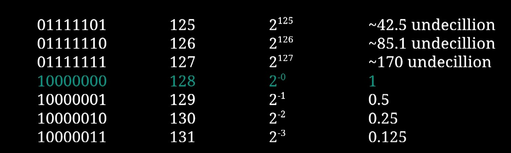 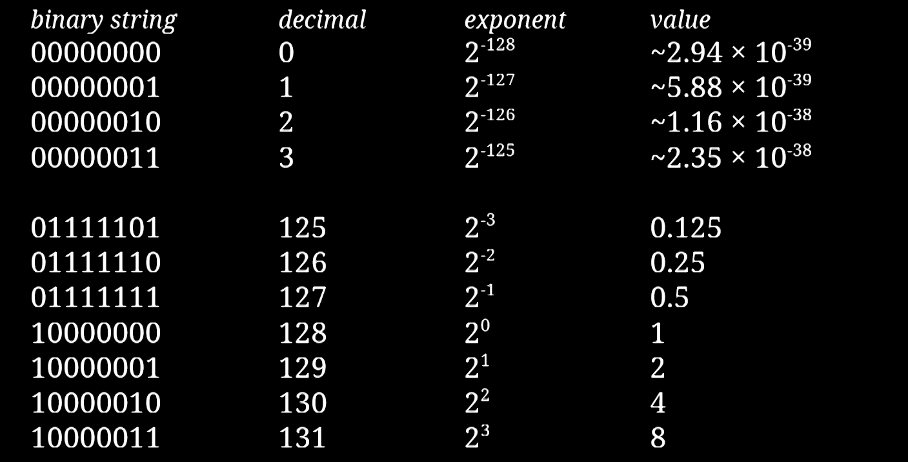
        3. The decimal point is moved to the first non-zero digit
        4. 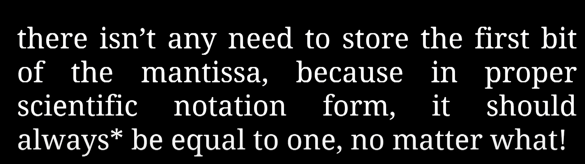
        5. so there are two remaining issues:  Maybe we could use that unbalanced extra one
           number to write 0. 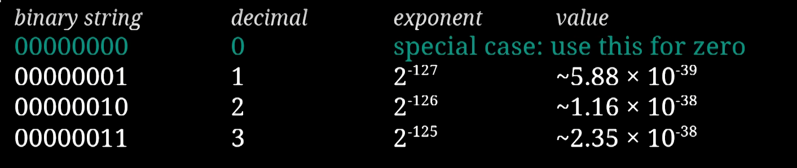 But once again, there are too many ways to write zero.
           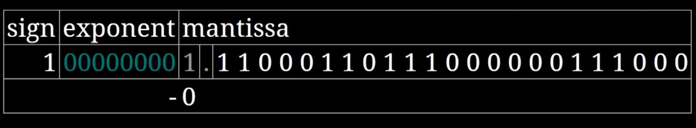 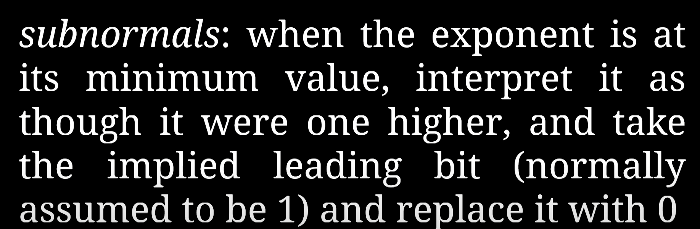
    8. Floating point numbers aren't exactly real numbers in the mathematical sense. For example, three is not exactly
       three, but a number which is closer to three than it is to any other floating point number.
    9.  because zero means " a number too small to write normally" 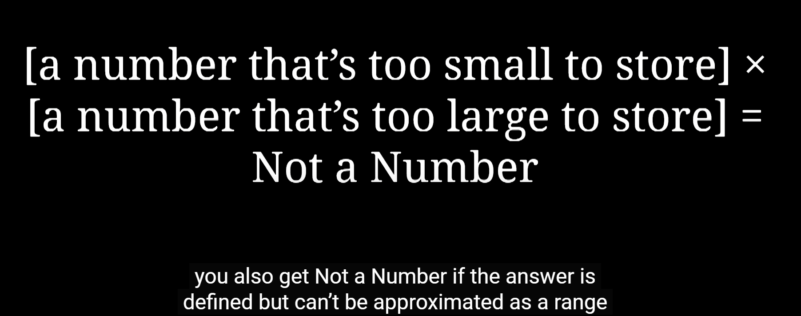
15. underflows
    1. Underflow is a condition which occurs in a computer or similar device when a mathematical operation results in a
       number which is smaller than what the device is capable of storing.
16. loss scaling
    1. Loss scaling is a technique to prevent numeric underflow in intermediate gradients when float16 is used. To
       prevent underflow, the loss is multiplied (or "scaled") by a certain factor called the "loss scale", which causes
       intermediate gradients to be scaled by the loss scale as well.
17. It seems like the dataset influence the most language model performance. This is understandable, while the things we
    teach children make who they are. However, the model doesn't have a judgement ability itself like what kind of stuff
    is good and should be learned.

Summary
================
This paper provides a new large language model called OPT (stands for Open Pre-trained Transformer). It aims at provide
normal research a better knowledge and understanding of language models. Thus, OPT is fully open sourced. By comparing
the performance on different task, the toxic, bias, stereotype, etc questions, it shows that OPT is performing similarly
than the GPT3. However, it only requires 1/7 carbon omit on training the 175b (same size as GPT) model. 
