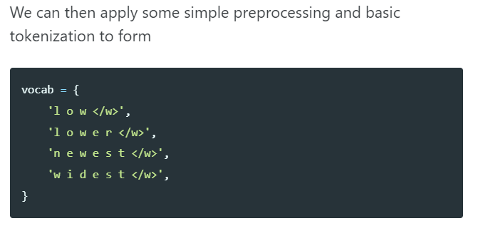
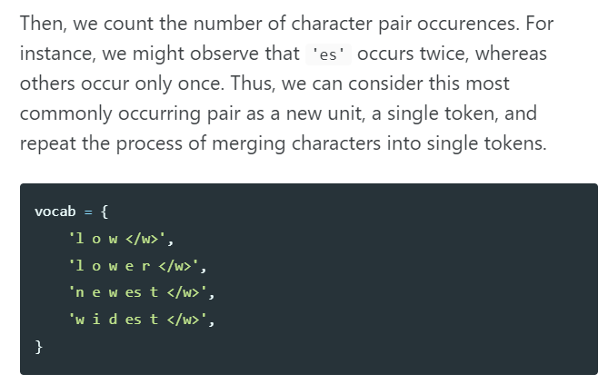
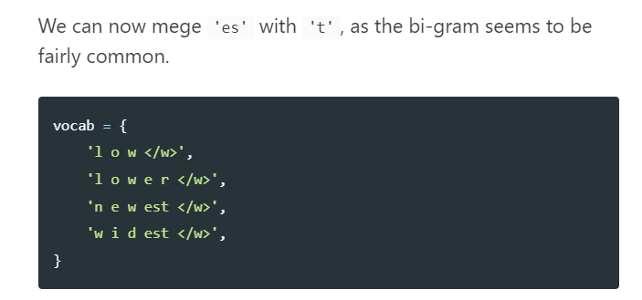

Link
===============

https://jaketae.github.io/study/gpt2/

Notes
===============

1. Byte Pair Encoding (BPE)
    1. Word-level embeddings cannot handle rare words elegantly (<UNK>)
    2. Character-level embeddings are ineffective since characters do not really hold semantic mass
        1. f we think about it, the real meaning of words come from units that are larger than characters, but smaller
           than words. For example, the word “bigger” is really a combination of “big” and the comparative “-er”. From
           this admittedly simplified example, one might deduce that we should create embeddings for these intermediate
           units that lie between characters and words. Hence BPE, or other variant tokenization methods such as
           word-piece embeddings used in BERT, employ clever techniques to be able to split up words into such
           reasonable units of meaning.
2. BPE in the context of NLP and tokenization uses a similar technique, but is slightly different in that we don’t
   compress the original sequence via substitution; instead, recurring bi-grams are merged into a single token (a
   uni-gram).
    1. 
    2. 
    3. 
    4. 
    5. In theory, if we repeat this process with a huge corpus for a set amount of iterations—which is a hyperparameter
       we can control—we would end up with reasonable units that occur most frequently. The idea is that these
       combinations of character sequences that occur more frequently should encode some meaning, similar to what we saw
       with “-er” in the “bigger” example.

Thoughts with Additional Information
===============

1. Word-level embeddings cannot handle rare words elegantly (<UNK>)
    1. Maybe it is because there are too many words to put in the embeddings?
    2. why can't we handle all the rare words?
2. Character-level embeddings are ineffective since characters do not really hold semantic mass
    1. so rare words handling issue is bigger than no semantic mass issue? why?
    2. what exactly is the semantic meaning in encoding, why the meanings are important.
    3. if it's in Chinese, are these questions all gone?
3. The idea is that these combinations of character sequences that occur more frequently should encode some meaning,
   similar to what we saw with “-er” in the “bigger” example.
   1. what corpus did GPT-2 use for doing this process? the whole dataset? Is it too big to do it?

Summary
===============
