Link
===============

Gradient Descent Algorithm — a deep dive
https://towardsdatascience.com/gradient-descent-algorithm-a-deep-dive-cf04e8115f21#:~:text=Gradient%20descent%20(GD)%20is%20an,e.g.%20in%20a%20linear%20regression

Gradient Descent, Step-by-Step
https://www.youtube.com/watch?v=sDv4f4s2SB8

Gradient Descent
https://www.ibm.com/cloud/learn/gradient-descent

Gradient Descent
https://www.youtube.com/watch?v=4b4MUYve_U8&list=PLoROMvodv4rMiGQp3WXShtMGgzqpfVfbU&index=2

Notes
===============

1. Gradient descent algorithm does not work for all functions. There are two specific requirements. A function has to
   be:
    1. differentiable: If a function is differentiable it has a derivative for each point in its
       domain 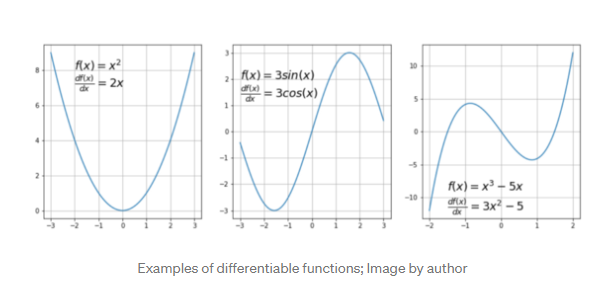 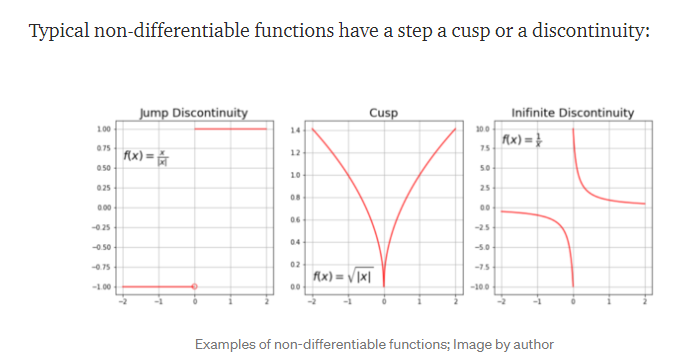
    2. convex: For a univariate function, this means that the line segment connecting two function’s points lays on or
       above its curve (it does not cross it). If it does it means that it has a local minimum which is not a global
       one. Another way to check mathematically if a univariate function is convex is to calculate the second derivative
       and check if its value is always bigger than 0. 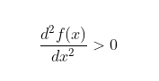 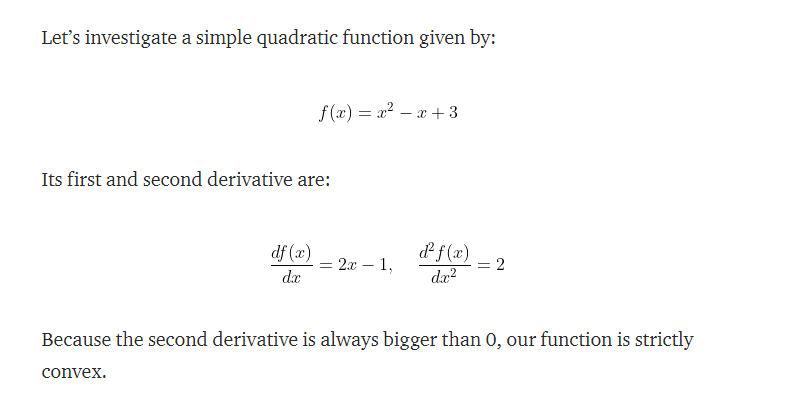
2. It is also possible to use quasi-convex functions with a gradient descent algorithm. However, often they have
   so-called saddle points (called also minimax points) where the algorithm can get stuck. An example of a quasi-convex
   function is: 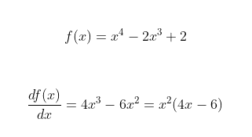
    1. We see that the first derivative equal zero at x=0 and x=1.5. This places are candidates for function’s extrema (
       minimum or maximum )— the slope is zero there.
    2. The value of this expression is zero for x=0 and x=1. These locations are called an inflexion point — a place
       where the curvature changes sign — meaning it changes from convex to concave or
       vice-versa. 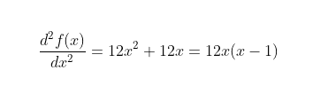
    3. for x<0: function is convex
    4. for 0<x<1: function is concave (the 2nd derivative < 0)
    5. for x>1: function is convex again
    6. Now we see that point x=0 has both first and second derivative equal to zero meaning this is a saddle point and
       point x=1.5 is a global minimum. 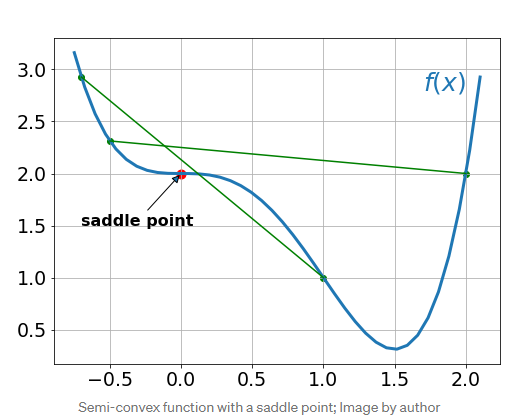
3. What is a gradient
    1. Intuitively it is a slope of a curve at a given point in a specified direction.
    2. In the case of a univariate function, it is simply the first derivative at a selected point. In the case of a
       multivariate function, it is a vector of derivatives in each main direction (along variable axes). Because we are
       interested only in a slope along one axis and we don’t care about others these derivatives are called partial
       derivatives.
    3. A gradient for an n-dimensional function f(x) at a given point p is defined as follows: 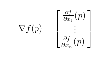
    4. For 2-dimentional function 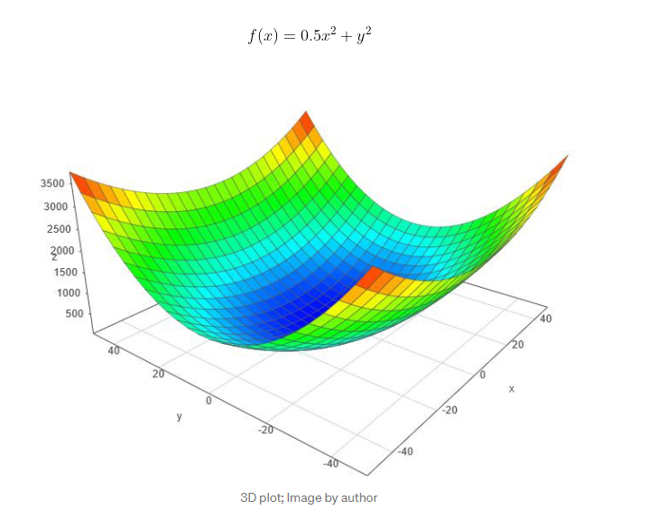 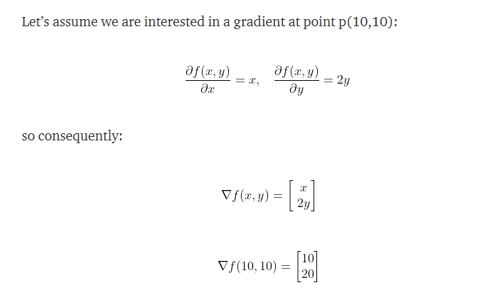
        1. By looking at these values we conclude that the slope is twice steeper along the y-axis.
4. Gradient Descent Algorithm
    1. Gradient Descent Algorithm iteratively calculates the next point using gradient at the current position, scales
       it (by a learning rate) and subtracts obtained value from the current position (makes a step). It subtracts the
       value because we want to minimise the function (to maximise it would be adding). This process can be written as:
        1. 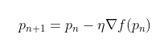
        2. There’s an important parameter η which scales the gradient and thus controls the step size. In machine
           learning, it is called learning rate and have a strong influence on performance.
            1. The smaller learning rate the longer GD converges, or may reach maximum iteration before reaching the
               optimum point
            2. If learning rate is too big the algorithm may not converge to the optimal point (jump around) or even to
               diverge completely.
    2. The steps of Gradient Descent method:
        1. choose a starting point (initialisation)
        2. calculate gradient at this point
        3. make a scaled step in the opposite direction to the gradient (objective: minimise)
        4. repeat points 2 and 3 until one of the criteria is met:
            1. maximum number of iterations reached
            2. step size is smaller than the tolerance (due to scaling or a small gradient).
5. Different types of gradient descent
    1. Batch gradient descent
        1. Batch gradient descent sums the error for each point in a training set, updating the model only after all
           training examples have been evaluated. This process referred to as a training epoch.
    2. Stochastic gradient descent
        1. Stochastic gradient descent (SGD) runs a training epoch for each example within the dataset and it updates
           each training example's parameters one at a time. Since you only need to hold one training example, they are
           easier to store in memory. While these frequent updates can offer more detail and speed, it can result in
           losses in computational efficiency when compared to batch gradient descent. Its frequent updates can result
           in noisy gradients, but this can also be helpful in escaping the local minimum and finding the global one.
    3. Mini-batch gradient descent
        1. Mini-batch gradient descent combines concepts from both batch gradient descent and stochastic gradient
           descent. It splits the training dataset into small batch sizes and performs updates on each of those batches.
           This approach strikes a balance between the computational efficiency of batch gradient descent and the speed
           of stochastic gradient descent.
6. Vanishing and Exploding Gradients
    1. Vanishing gradients:  This occurs when the gradient is too small. As we move backwards during backpropagation,
       the gradient continues to become smaller, causing the earlier layers in the network to learn more slowly than
       later layers. When this happens, the weight parameters update until t hey become insignificant—i.e. 0—resulting in
       an algorithm that is no longer learning.
    2. Exploding gradients: This happens when the gradient is too large, creating an unstable model. In this case, the
       model weights will grow too large, and they will eventually be represented as NaN. One solution to this issue is
       to leverage a dimensionality reduction technique, which can help to minimize complexity within the model.
7. 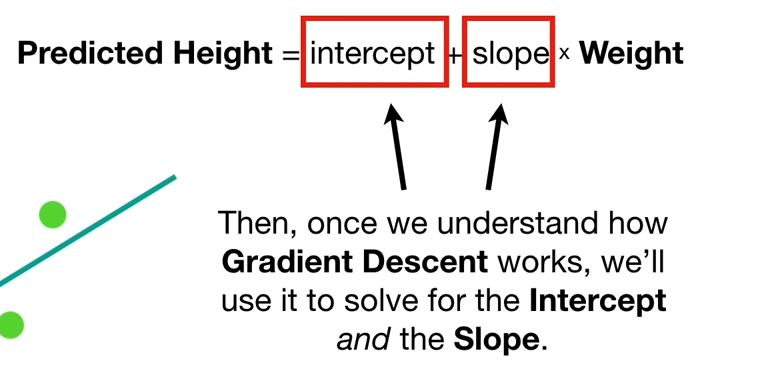 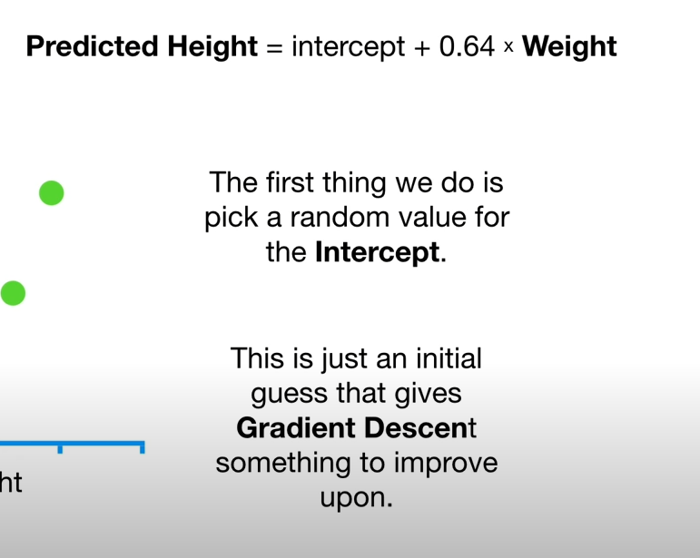 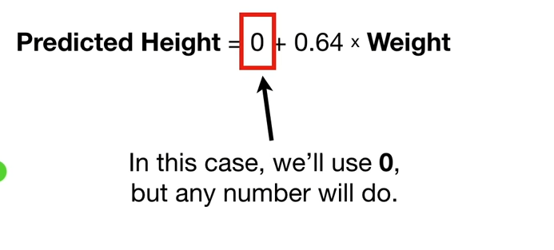 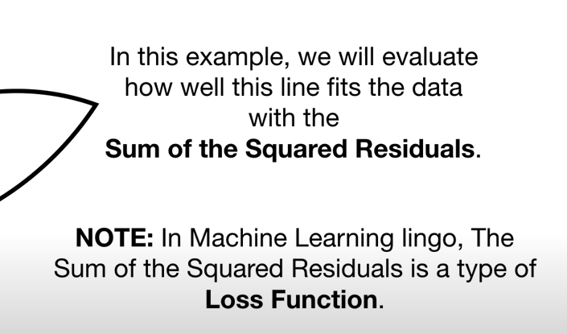
   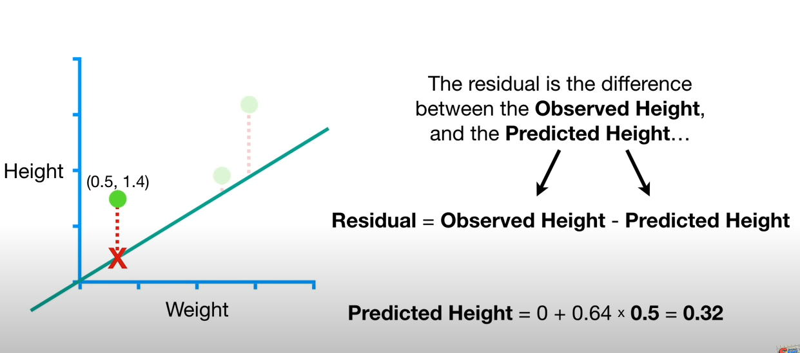 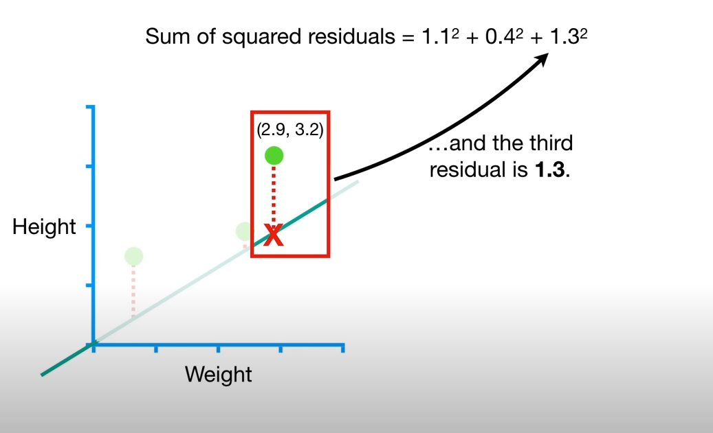 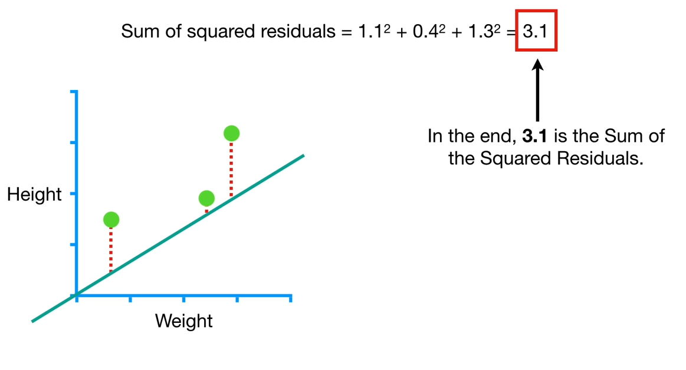 
   Gradient Descent only does a few calculations far from the optimal solution, and increases the number of calculations
   closer to the optimal value.
   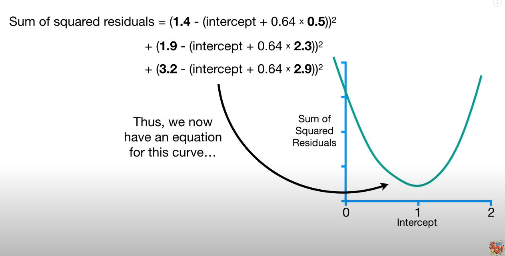 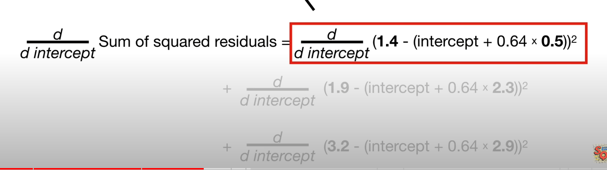 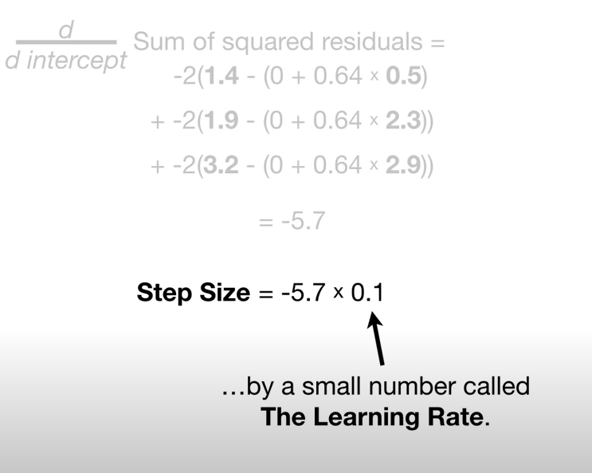 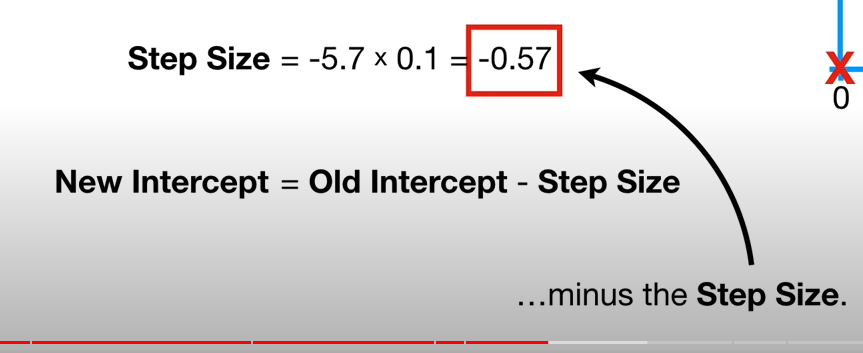
   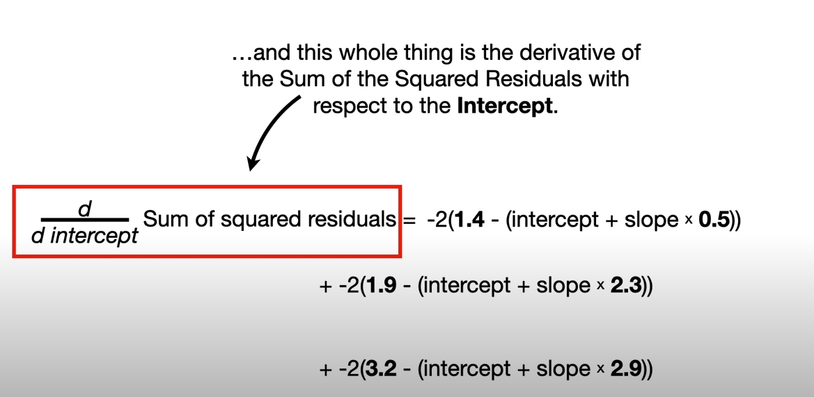 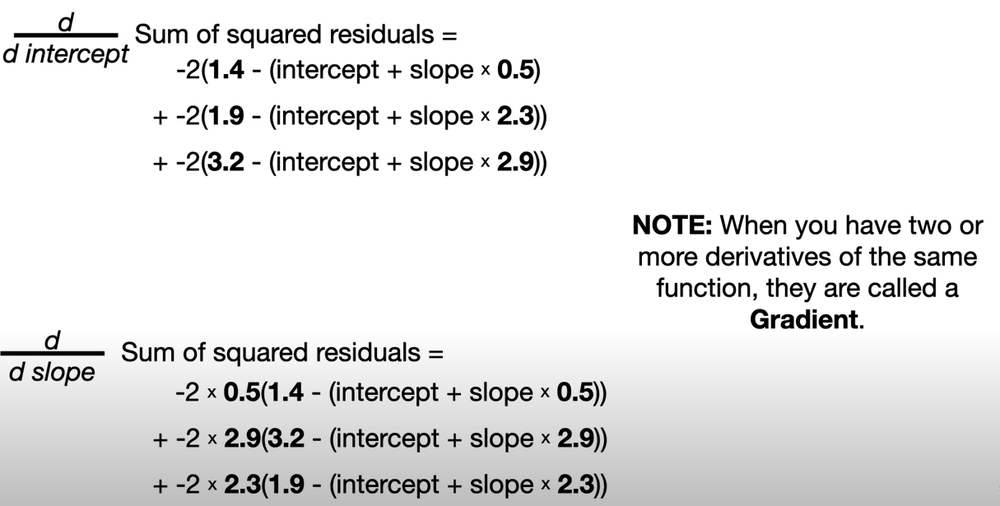 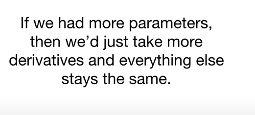 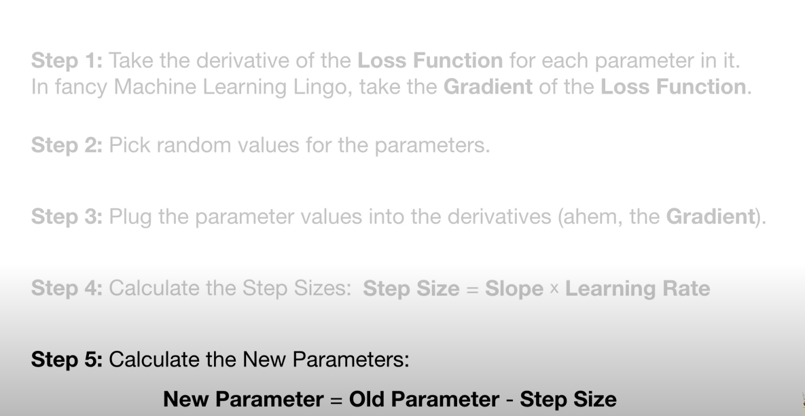
   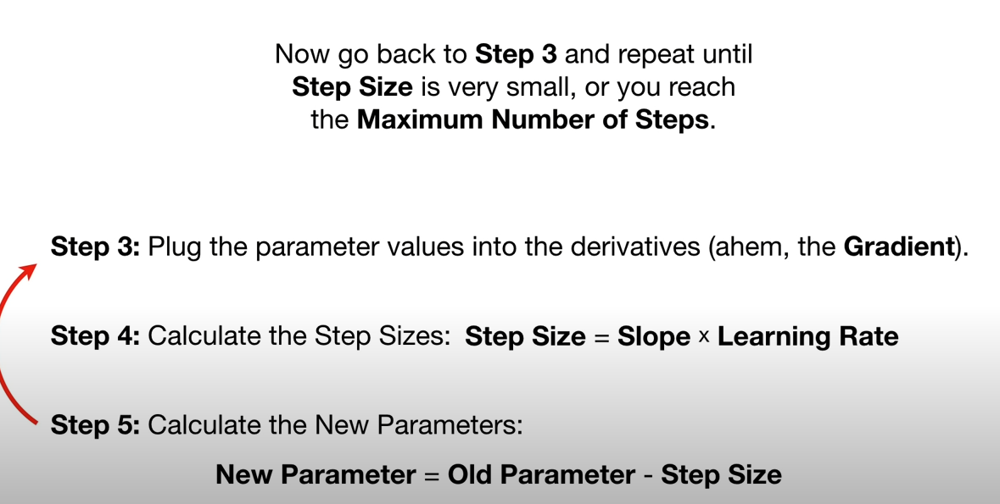

Thoughts with Additional Information
===============

1. univariate function
    1. A univariate function has only one variable.
2. what type of function is for a neural network? Is it a univariate function or multivariate function?
    1. univariate? because all neurons are actually a univariate function y = ax + b
3. Tangent line:
    1. the tangent line to a plane curve at a given point is the straight line that "just touches" the curve at that
       point.
4. why Stochastic gradient descent can be helpful in escaping the local minimum and finding the global one.

Summary
===============
